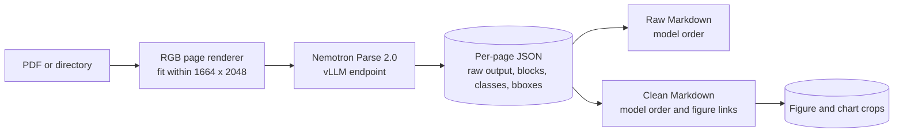

# Parzer: Direct Nemotron Parse 2.0 Harness

Parzer renders PDF pages and sends each complete page directly to
[`nvidia/NVIDIA-Nemotron-Parse-2.0`](https://huggingface.co/nvidia/NVIDIA-Nemotron-Parse-2.0)
through a vLLM OpenAI-compatible endpoint. It preserves model block order, caches every page response,
and produces Markdown plus optional figure and chart crops.

It intentionally does not use the NeMo Retriever Library or add synthetic document/page headings,
OCR repair, deskewing, denoising, or semantic heading reconstruction.

## Pipeline



## Install

```bash
git clone git@github.com:dreamhunter02/parzer.git
cd parzer
uv sync
```

## Serve Parse 2.0

The model card currently lists vLLM 0.20-0.26 as supported. On A100 and A10 GPUs, it recommends
the Triton attention backend.

```bash
vllm serve nvidia/NVIDIA-Nemotron-Parse-2.0 \
  --dtype bfloat16 \
  --max-num-seqs 8 \
  --limit-mm-per-prompt '{"image": 1}' \
  --attention-backend=TRITON_ATTN \
  --trust-remote-code \
  --port 8000
```

## Extract PDFs

```bash
uv run python -m parse_harness extract \
  --input PDFs/ \
  --output results/ \
  --base-url http://127.0.0.1:8000/v1 \
  --output-mode both \
  --figure-mode crop \
  --concurrency 8 \
  --resume
```

The model defaults to `nvidia/NVIDIA-Nemotron-Parse-2.0`. Override `--model` only when the vLLM
server exposes the same Parse 2.0 model under a different identifier.

`--input` accepts one PDF or a directory searched recursively. Each page is retried independently,
so a failed page does not discard the rest of its document. Use `--resume` to reuse rendered pages
and successful cached responses.

## Outputs

```text
results/
  manifest.jsonl
  pages/<document>/page_0001.png
  raw_responses/<document>/page_0001.json
  markdown/raw/<document>.md
  markdown/zoom/<document>.md
  assets/<document>/page_0001_chart_01.png
  errors.jsonl
```

Each cached page contains the source PDF, page number, rendered dimensions, raw generation, ordered
blocks, semantic classes, normalized bounding boxes, model-canvas bounding boxes, and rendered-page
bounding boxes.

## Parse 2.0 defaults

- RGB page images use the largest aspect-preserving size within the recommended `1664 x 2048` maximum.
- The official structured extraction prompt is used.
- Generation uses temperature `0`, top-k `1`, repetition penalty `1.1`, and up to `9000` tokens.
- Special tokens remain enabled in the vLLM response so classes and bounding boxes can be decoded.
- `Picture`, `Figure`, and Parse 2.0 `Chart` blocks can be exported as crops.

## Test

```bash
uv run python -m unittest discover -s tests -v
```

Nemotron Parse 2.0 is licensed separately under the OpenMDW License Agreement 1.1. Review the
model card before distributing or deploying model weights.
